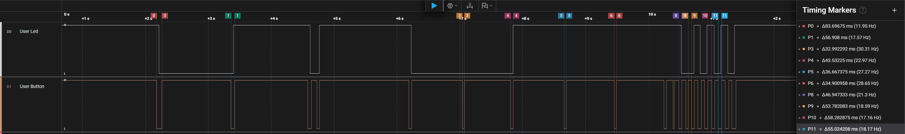
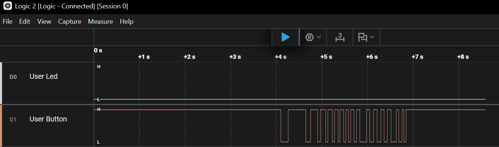
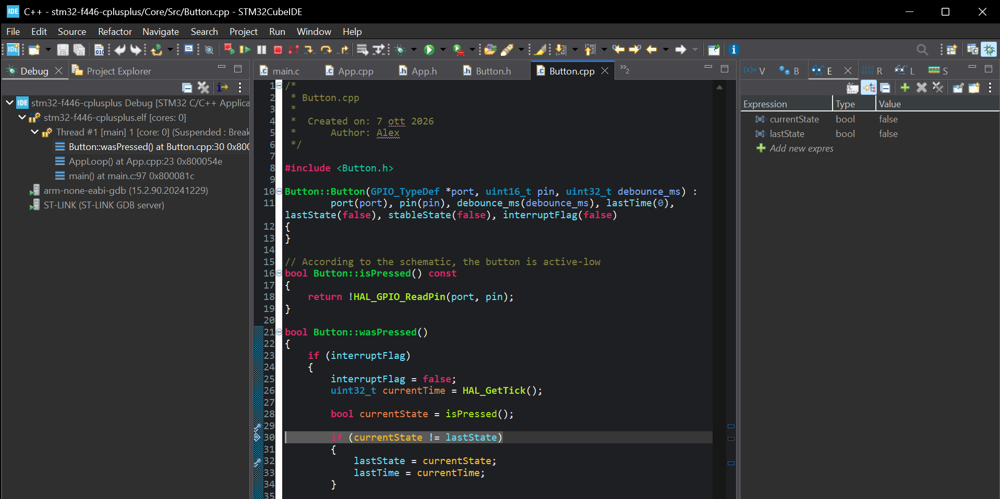
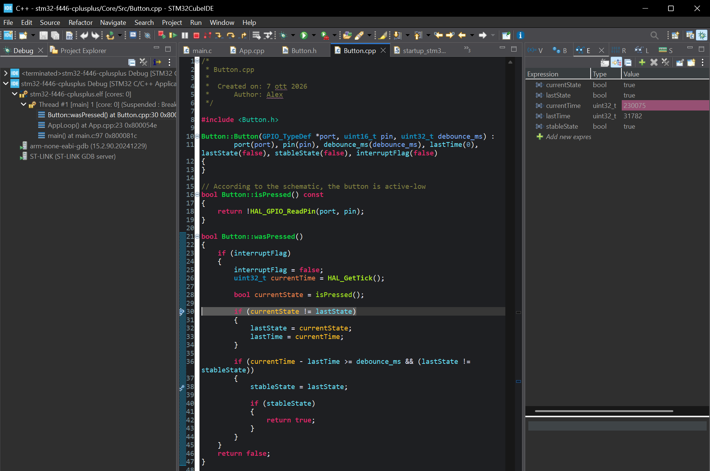
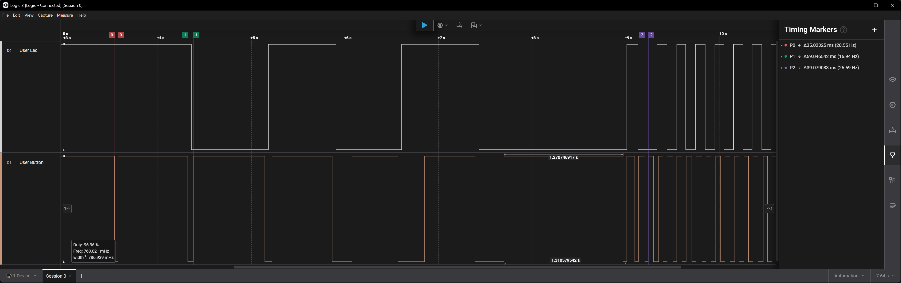

# Learning Log

### At the start of this journey, it had been about four months since my last embedded project at work. During that time, I had been working on web development because that was what my job required.

## Step 01 — LED Control and C/C++ Integration

- Date: 07-10-2026
- Goal: Control the onboard LED through a C++ class.

### Implementation

I created a Led class with four methods:

- on() — Turns the LED on.
- off() — Turns the LED off.
- toggle() — Inverts the LED state.
- isOn() — Returns the state stored by the class.

The GPIO port and pin are initialized through the constructor's member initializer list. Both members are constant so that each Led object remains associated with the same port and pin.

The application layer in App.cpp creates the onboard LED object and provides two functions:

- AppInit() sets the initial LED state after GPIO initialization.
- AppLoop() toggles the LED and waits 500 ms.

These functions are declared in App.h using conditional extern "C" guards, allowing them to be called from main.c.

### Problems incountered

The linker reported undefined reference to AppInit and undefined reference to AppLoop.

The build log showed that App.cpp and Led.cpp were not being compiled.

Solution: I selected Convert to C++ from the project's context menu in STM32CubeIDE. This resolved the build issue.

Lesson learned: Creating C++ source files does not necessarily enable C++ support in the project's build configuration. Checking the build commands helped identify the missing compilation steps.

### Verification

The expected behaviour is an LED state change every 500 ms.

The logic analyser records an edge approximately every 502 ms. I am not sure whether this difference comes from the logic analyser or the microcontroller. I would like to check it with an oscilloscope, but I do not have one. For now, this is good enough.

### What I learned

- How to resolve the linker error and create a bridge between C and C++.
- The difference between const data members and const constructor parameters.
- The difference between const GPIO_TypeDef* port and GPIO_TypeDef* const port.

## Step 02 — LED Control Through the Onboard Button

- Date: 07-10-2026
- Goal: Change the state of the onboard LED using the onboard button.

### Implementation

I created a Button class with one method:
- isPressed() — Returns the state of the button.

### Problems encountered

The onboard button has a pull-up:

I couldn't find information about the pull-up in the user manual, so I checked the schematic and confirmed its presence:

Solution: I inverted the button reading in isPressed().

A single short press causes multiple state changes:

Solution 1: I could implement logic to ignore all inputs after a state change from LOW to HIGH and accept a new input only after the LED is LOW and the button is HIGH (active-low).

Solution 2: Implement debounce logic that accepts an input only if the button state has been stable for 30–40 ms.

I chosed to implement the second solution.

## Step 03 — LED Control Through the Onboard Button with Debounce

- Date: 09-10-2026
- Goal: The button changes the LED state only after remaining LOW (pressed) for at least 40 ms.

### Implementation

I implemented button debounce in a new method:
- wasPressed() — Return true only if Button has a stable state >= 40ms and is LOW (pressed).

### Verification

## Step 04 — LED Control Through the Onboard Button with Interrupts

- Date: 10-10-2026
- Goal: Replace onboard button polling with interrupt-based detection.

### Implementation

I reconfigured PC13 as GPIO_EXTI13 in STM32CubeMX, enabled the interrupt in the NVIC interrupt table, and regenerated the code. Then I opened the newly created stm32f4xx_it.c file and looked for EXTI15_10. Using Ctrl + Click, I found the __weak function called when an interrupt occurs: HAL_GPIO_EXTI_Callback.

Another approach I used when I didn't know how to find the __weak function was to open the corresponding driver file under Drivers/STM32F4xx_HAL_Driver/Src/ and use the Outline to find the relevant function.

### What I learned

Initially, I put the callback function in Button.cpp and used it only to manage a global flag. ChatGPT explained why I should keep the connection between the hardware and the application in App.cpp. I then considered moving the callback to App.cpp, creating a static volatile bool interruptFlag, and polling only that flag in AppLoop().

However, ChatGPT suggested that App.cpp should only notify the Button object of the interrupt and let it handle the remaining logic. This would keep App.cpp from being responsible for the internal behaviour of Button and improve encapsulation.

That makes sense, but now I am polling a function that checks a flag inside Button. I am not sure whether this is the right approach, but for now, I will keep it and see how it develops. It reminds me of the MVC architecture, with App.cpp acting as the controller. If that is the idea, I like it.

### Verification

On the first run, the LED did not respond to the button at all.

I started a debugging session and set a breakpoint to see what was happening inside the function.

I found that the interrupt occurred only when I released the button (rising edge). I changed the GPIO mode to falling-edge interrupt detection in STM32CubeMX and tested it again.

The LED then turned on only after the second button press and stayed on. After several tests, I noticed that once the flags became true, they never changed back.

When I pressed the button, an interrupt occurred, but currentState was always true, blocking the rest of the logic. I needed to configure interrupt detection on both rising and falling edges.

The next problem was that currentTime and lastTime were always equal. The logic could not work as written: each interrupt caused lastState to differ from the current state, resetting lastTime to currentTime.

I need to separate interrupt handling from debouncing. The interrupt will start the debounce process. While debouncing is active, I will poll the button and accept the press only after its state has remained stable for at least 40 ms and the button is pressed.

