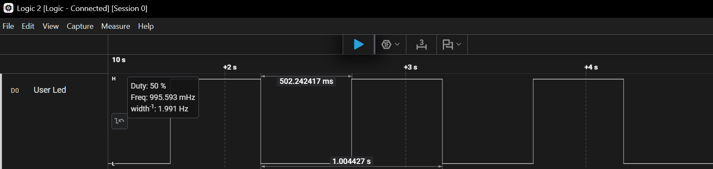
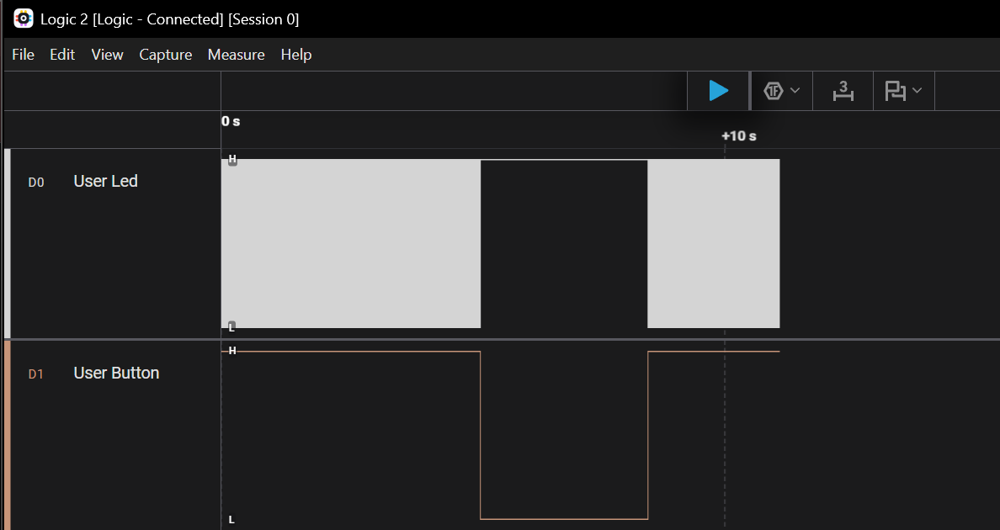
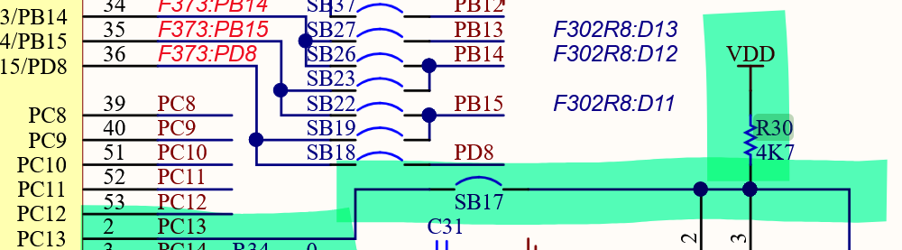
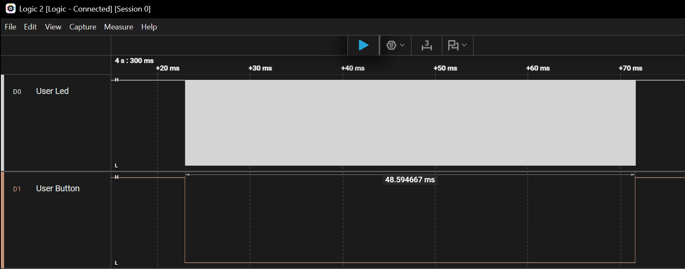

# Learning Log

## Step 01 — LED Control and C/C++ Integration

- Date: 07-10-2026
- Goal: Control the onboard LED through a C++ class.

### Implementation

I created a Led class with four methods:

- on() — Turns the LED on.
- off() — Turns the LED off.
- toggle() — Inverts the LED state.
- isOn() — Returns the state stored by the class.

The GPIO port and pin are initialized through the constructor's member initializer list. Both members are constant so that each Led object remains associated with the same port and pin.

The application layer in App.cpp creates the onboard LED object and provides two functions:

- AppInit() sets the initial LED state after GPIO initialization.
- AppLoop() toggles the LED and waits 500 ms.

These functions are declared in App.h using conditional extern "C" guards, allowing them to be called from main.c.

### Problems incountered

The linker reported undefined reference to AppInit and undefined reference to AppLoop.

The build log showed that App.cpp and Led.cpp were not being compiled.

Solution: I selected Convert to C++ from the project's context menu in STM32CubeIDE. This resolved the build issue.

Lesson learned: Creating C++ source files does not necessarily enable C++ support in the project's build configuration. Checking the build commands helped identify the missing compilation steps.

### Verification

The expected behaviour is an LED state change every 500 ms.

The logic analyser records an edge approximately every 502 ms. I am not sure whether this difference comes from the logic analyser or the microcontroller. I would like to check it with an oscilloscope, but I do not have one. For now, this is good enough.

### What I learned

- How to resolve the linker error and create a bridge between C and C++.
- The difference between const data members and const constructor parameters.
- The difference between const GPIO_TypeDef* port and GPIO_TypeDef* const port.

## Step 02 — LED Control Through the Onboard Button

- Date: 07-10-2026
- Goal: Change the state of the onboard LED using the onboard button.

### Implementation

I created a Button class with one method:
- isPressed() — Returns the state of the button.

### Problems encountered

The onboard button has a pull-up:

I couldn't find information about the pull-up in the user manual, so I checked the schematic and confirmed its presence:

Solution: I inverted the button reading in isPressed().

A single short press causes multiple state changes:

Solution 1: I could implement logic to ignore all inputs after a state change from LOW to HIGH and accept a new input only after the LED is LOW and the button is HIGH (active-low).

Solution 2: Implement debounce logic that accepts an input only if the button state has been stable for 30–40 ms.

I chosed to implement the second solution.

